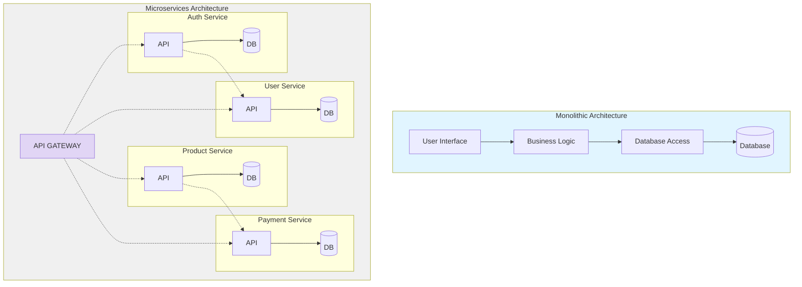
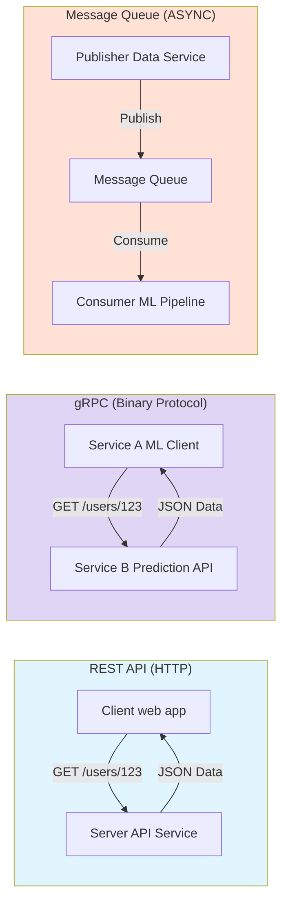
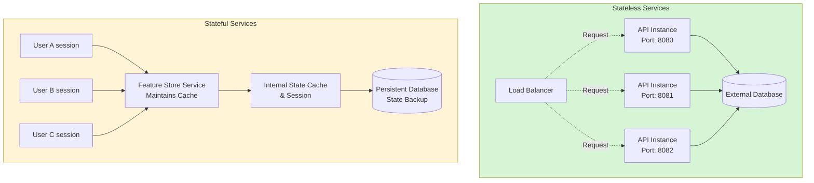
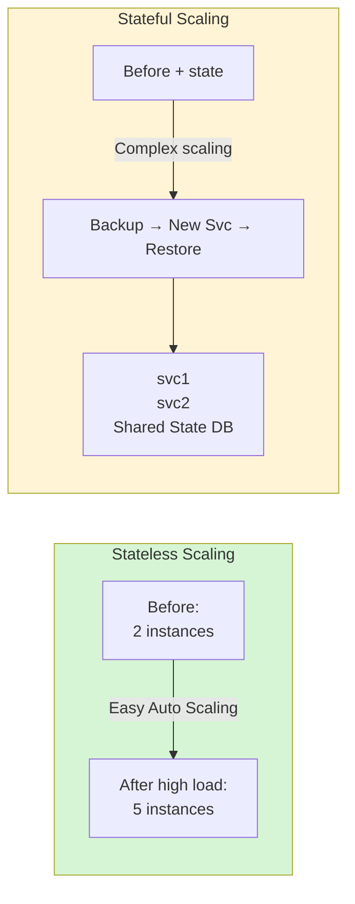
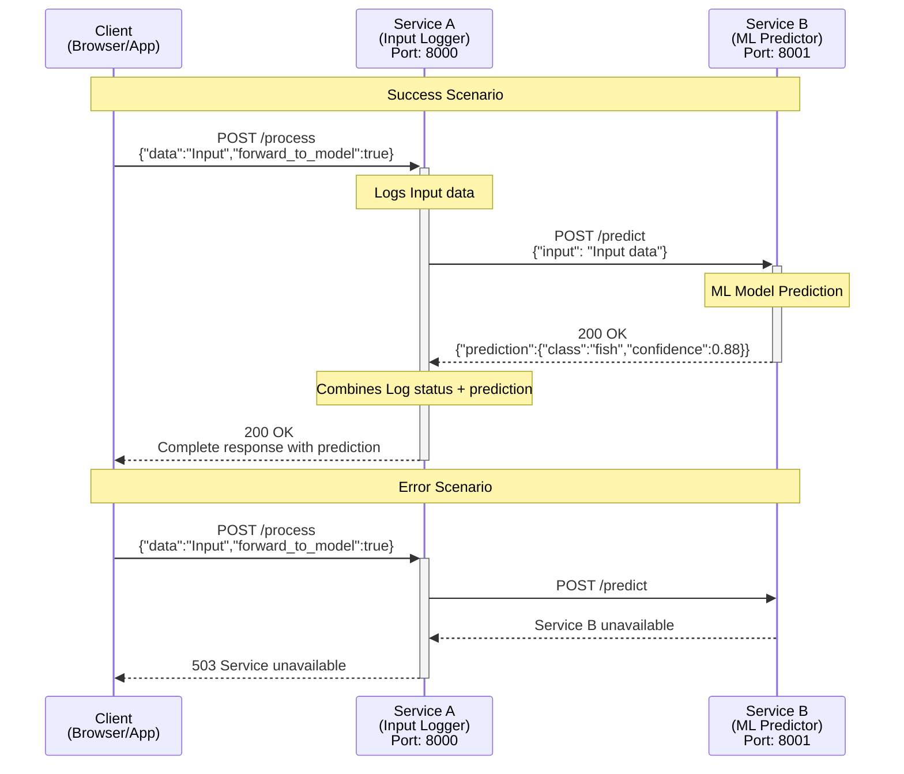

# ML Microservices Lab (2 Services) — Theory + Hands-on

This repository contains a complete, runnable **two-microservice** lab for a simple machine-learning-style system:

- **Service A (Input Logger / Gateway)**: Receives client requests, logs inputs, and optionally forwards the request to the ML service.
- **Service B (ML Predictor)**: A dedicated service that returns a mock "prediction" (random class + confidence) for demo purposes.

The project is designed to teach both:
1) **Microservices theory (why/how)**, and  
2) The **practical workflow** of running two independent services that communicate over HTTP.

---

## Repo structure

```text
ml_microservices_lab/
├── service_a/
│   ├── main.py
│   ├── requirements.txt
│   └── Dockerfile
├── service_b/
│   ├── main.py
│   ├── requirements.txt
│   └── Dockerfile
├── docker-compose.yml
├── .dockerignore
├── .gitignore
└── README.md
```

> **Recommended local practice:** create a **separate Python virtual environment (venv) per service**.
That mirrors real microservices deployments (one container/image per service).

---

# Part 1 — Microservices Concepts (Complete Theory)

## 1) Monolithic vs Microservices

### Architecture Comparison



**Monolithic Architecture:**
- Tightly coupled components
- Single codebase
- Single deployment unit

**Microservices Architecture:**
- Loosely coupled services
- Independent codebases
- Separate deployment units
- Communication via APIs

### Monolithic architecture
A monolith is a single deployable unit where UI, business logic, and data access are tightly coupled.

**Pros:**
- Simple at the beginning
- Easy local debugging
- Single deployment pipeline

**Cons (especially for ML systems):**
- Hard to scale specific parts (inference vs training)
- Technology lock-in (one stack for everything)
- Risky deployments (small change redeploys everything)
- Slower teams (coordination & merge conflicts)
- ML workflows are diverse (data ingestion, preprocessing, training, inference all need different resources)

### Microservices architecture
Microservices split the system into **small independent services** that communicate via APIs.

**Key principles:**
- **Single responsibility**: one service does one job well
- **Autonomy**: services build/deploy/scale independently
- **Resilience**: failure stays contained
- **Polyglot**: each service can choose the best tech stack
- **Decentralized data**: each service may own its own storage if needed

**Why microservices fit ML:**
- Inference scales with traffic; training scales with data/model complexity
- Different services can use different frameworks (FastAPI, TensorFlow, PyTorch, Spark, etc.)
- You can deploy new model versions with lower blast radius
- Observability can be ML-aware (latency + drift + model performance)

---

## 2) Core services in an ML microservices platform

A robust ML microservices platform consists of multiple specialized services, each handling a specific aspect of the machine learning lifecycle. Understanding these core services helps in designing scalable and maintainable ML systems.

### ML Microservices Architecture Overview

```mermaid
graph TB
    subgraph External["<b>External Data Sources</b>"]
        DB[("<b>Databases</b>")]
        API["<b>APIs</b>"]
        Stream["<b>Data Streams</b>"]
        Files["<b>File Storage</b>"]
    end
    
    subgraph Ingestion["<b>Data Ingestion Service</b>"]
        DI["<b>Ingestion API</b>"]
        DI ==>|"<b>Validate Schema</b>"| DI
        DI ==>|"<b>Publish Events</b>"| Events
    end
    
    subgraph Processing["<b>Data Processing Layer</b>"]
        Preproc["<b>Preprocessing Service</b>"]
        FE["<b>Feature Engineering Service</b>"]
        Preproc ==>|"<b>Clean & Transform</b>"| Preproc
        FE ==>|"<b>Create Features</b>"| FS
    end
    
    subgraph Storage["<b>Storage & Registry Layer</b>"]
        FS[("<b>Feature Store</b>")]
        MR["<b>Model Registry Service</b>"]
        DV["<b>Data Versioning Service</b>"]
        Meta["<b>Metadata Service</b>"]
    end
    
    subgraph Training["<b>Model Development Layer</b>"]
        MT["<b>Model Training Service</b>"]
        ET["<b>Experiment Tracking Service</b>"]
        MT ==>|"<b>Register Models</b>"| MR
        MT ==>|"<b>Log Experiments</b>"| ET
        ET ==>|"<b>Track Metrics</b>"| Meta
    end
    
    subgraph Serving["<b>Model Serving Layer</b>"]
        Gateway["<b>API Gateway</b>"]
        MA["<b>Model API Service</b>"]
        MD["<b>Model Deployment Service</b>"]
        MA ==>|"<b>Load Models</b>"| MR
        MD ==>|"<b>Deploy</b>"| MA
    end
    
    subgraph Monitoring["<b>Observability Layer</b>"]
        Monitor["<b>Monitoring Service</b>"]
        Notify["<b>Notification Service</b>"]
        Monitor ==>|"<b>Alerts</b>"| Notify
    end
    
    subgraph Support["<b>Supporting Services</b>"]
        Auth["<b>Auth & Authorization</b>"]
        Config["<b>Configuration Management</b>"]
        DL["<b>Data Lineage Service</b>"]
        MG["<b>Model Governance Service</b>"]
        AB["<b>A/B Testing Service</b>"]
        BP["<b>Batch Processing Service</b>"]
    end
    
    subgraph Orchestration["<b>Orchestration Layer</b>"]
        WF["<b>Workflow Orchestration</b><br/><b>Airflow/Argo</b>"]
        CICD["<b>CI/CD Service</b>"]
    end
    
    %% Data Flow - Thick arrows
    External ==> DI
    DI ==> Preproc
    Preproc ==> FS
    FE ==> FS
    FS ==> MT
    MT ==> MR
    MR ==> MA
    Gateway ==> MA
    
    %% Monitoring connections - Thick dashed arrows
    MA ==.>|"<b>Metrics</b>"| Monitor
    MT ==.>|"<b>Metrics</b>"| Monitor
    Preproc ==.>|"<b>Metrics</b>"| Monitor
    
    %% Supporting connections - Thick dashed arrows
    Auth ==.>|"<b>Secure</b>"| Gateway
    Auth ==.>|"<b>Secure</b>"| MT
    Config ==.>|"<b>Configure</b>"| MA
    Config ==.>|"<b>Configure</b>"| MT
    DL ==.>|"<b>Track</b>"| Preproc
    DL ==.>|"<b>Track</b>"| FE
    MG ==.>|"<b>Govern</b>"| MR
    AB ==.>|"<b>Test</b>"| MA
    BP ==.>|"<b>Process</b>"| Preproc
    
    %% Orchestration - Thick dashed arrows
    WF ==.>|"<b>Orchestrate</b>"| MT
    WF ==.>|"<b>Orchestrate</b>"| Preproc
    CICD ==.>|"<b>Deploy</b>"| MD
    
    %% Metadata connections - Thick dashed arrows
    Meta ==.>|"<b>Store Metadata</b>"| FS
    Meta ==.>|"<b>Store Metadata</b>"| MR
    Meta ==.>|"<b>Store Metadata</b>"| DV
    
    style Ingestion fill:#e1f5ff,stroke:#01579b,stroke-width:3px
    style Processing fill:#f3e5f5,stroke:#4a148c,stroke-width:3px
    style Storage fill:#fff3e0,stroke:#e65100,stroke-width:3px
    style Training fill:#e8f5e9,stroke:#1b5e20,stroke-width:3px
    style Serving fill:#fce4ec,stroke:#880e4f,stroke-width:3px
    style Monitoring fill:#fff9c4,stroke:#f57f17,stroke-width:3px
    style Support fill:#f1f8e9,stroke:#33691e,stroke-width:3px
    style Orchestration fill:#e0f2f1,stroke:#004d40,stroke-width:3px
```

### Core Services

#### Data Ingestion Service

The data ingestion service serves as the entry point for all data flowing into the ML system. It must handle diverse data sources, formats, and volumes while ensuring data integrity and reliability. A robust implementation should process both batch and streaming data with appropriate error handling and retry mechanisms.

**Key responsibilities:**
- Connecting to external sources (databases, APIs, streams)
- Validating incoming data against schemas
- Publishing events to trigger downstream processing

#### Preprocessing Service

Raw data rarely arrives in a form suitable for machine learning. The preprocessing service transforms this raw data into a clean, structured format ready for feature extraction and model training. It maintains versioned transformation pipelines to prevent training-serving skew.

**Key responsibilities:**
- Handling missing values and outliers
- Normalizing and standardizing data
- Applying domain-specific transformations

#### Feature Store Service

The feature store has emerged as a critical component in modern ML architectures, serving as a centralized repository for features used across multiple models. By centralizing feature computation and storage, it eliminates redundant processing and ensures consistent definitions.

**Key responsibilities:**
- Storing computed features with metadata
- Ensuring consistency between training and serving
- Enabling feature sharing across teams and models

#### Model Training Service

This service orchestrates the resource-intensive process of training ML models, from simple regression models to complex neural networks. It integrates with experiment tracking tools to maintain comprehensive records of training runs.

**Key responsibilities:**
- Executing training jobs on appropriate hardware
- Performing hyperparameter optimization
- Evaluating and registering trained models

#### Model API Service (Inference / Model API)

The model API service exposes trained models through well-defined interfaces, handling the critical transition from development to production. As the public face of the ML system, it requires special attention to reliability, scalability, and security.

**Key responsibilities:**
- Implementing prediction endpoints with appropriate interfaces
- Validating inputs and transforming outputs
- Monitoring performance metrics like latency and throughput

#### Monitoring Service

Continuous monitoring is essential to detect issues early and maintain performance over time. This service tracks both technical metrics and ML-specific concerns like data drift and concept drift.

**Key responsibilities:**
- Detecting data and concept drift
- Alerting on performance degradation
- Visualizing metrics through dashboards

### Additional Services

There are many other services that can enhance an ML microservices platform:

- **Metadata Service**: Manages metadata about datasets, models, and experiments
- **Experiment Tracking Service**: Logs and tracks ML experiments
- **Model Registry Service**: Versioned model artifacts + metadata + approvals
- **Data Versioning Service**: Tracks different versions of datasets
- **A/B Testing Service**: Enables experimentation with different model versions
- **Feature Engineering Service**: Automated feature creation and selection
- **Workflow Orchestration Service**: Workflow engines (Airflow, Argo Workflows, etc.)
- **Model Deployment Service**: Handles model deployment and rollback
- **Authentication & Authorization Service**: Security and access control
- **Configuration Management Service**: Centralized configuration
- **Data Lineage Service**: Tracks data flow and transformations
- **Model Governance Service**: Ensures compliance and model quality
- **Notification Service**: Alerts and notifications
- **Batch Processing Service**: Handles large-scale batch jobs
- **Continuous Integration/Continuous Deployment (CI/CD) Service**: Pipelines for code + model promotion

### This Lab's Focus

This lab focuses on a **minimal** slice to demonstrate core concepts:
- **Service A** = gateway/logging/orchestration (represents Data Ingestion + Gateway patterns)
- **Service B** = inference service (mock model) (represents Model API Service)

---

## 3) Communication patterns between services

### Limitations of REST

While REST is versatile, it's not optimal for all communication patterns:
- **Performance overhead** from HTTP headers and connection establishment
- **Limited support for bi-directional communication**
- **Can be verbose for complex data structures**
- **Not ideal for high-frequency, low-latency requirements**

### Communication Patterns Comparison



**REST API Key Features:**
- Synchronous request-response
- Standard HTTP methods
- Human-readable (JSON/XML)
- Stateless communication

**gRPC Key Features:**
- High Performance Binary Protocol
- Bi-directional Streaming
- Strong typing (Protocol Buffers)
- Multi-language support

**Message Queue Key Features:**
- Asynchronous messaging
- Reliable message delivery
- Decoupled services
- Load Balancing and buffering

### When to Use Each Pattern

**REST is Best For:**
- Public APIs and web services
- Simple CRUD operations
- Human-readable debugging
- Caching and standard HTTP features

**gRPC is Best For:**
- High performance internal APIs
- Real-time Streaming data
- Microservices Communication
- Low-Latency requirements

**Message Queues are Best For:**
- Event-driven architecture
- Background job processing
- Handling traffic spikes
- Loose coupling services

### REST (HTTP + JSON)
- Human-friendly, widely supported, easy testing with curl
- Great for request/response interactions
- Downsides: overhead of HTTP/JSON, less ideal for high-frequency low-latency calls

### gRPC (protobuf)
- Fast binary format, strong contracts, streaming support
- Great for internal service-to-service communication at scale
- Downsides: extra tooling + learning curve

### Message queues (Kafka, RabbitMQ, Pulsar)
- Asynchronous, decoupled communication
- Great for pipelines, buffering spikes, and event-driven architectures
- Patterns: pub-sub, point-to-point, request-reply, DLQ

This lab uses **REST** (simplest to learn and test).

---

## 4) Stateless vs Stateful services

### Characteristics of Stateless Services

**Independence from Previous Interactions:** Each request is processed without knowledge of previous requests. This enables any service instance to handle any request, facilitating simple horizontal scaling.

**Simplified Recovery:** If a stateless service instance fails, requests can be immediately redirected to another instance without data loss or inconsistency.

**Deployment Flexibility:** New versions can be deployed using strategies like blue-green deployment or rolling updates without complex state migration.

**Resource Efficiency:** Instances can be added or removed based on demand without concerns about state transfer.

### Architecture Comparison



**Stateless Benefits:**
- Easy horizontal scaling - add/remove instances anytime
- No data loss on failure - any instance can handle any request
- Simple deployment - rolling updates without state migration

**Stateful Challenges:**
- Complex scaling - state must be migrated or replicated
- Recovery complexity - state must be restored after failures
- Consistency challenges - multiple instances need synchronized state

### Scaling Comparison



### Real World Examples

**Stateless Services:**
- REST APIs
- ML inference
- Image processing
- Authentication

**Stateful Services:**
- Databases
- Session storage
- Shopping Carts
- Real-time Gaming

### Stateless service
Does NOT store client session state between requests.
- Easy horizontal scaling
- Easy recovery (just restart instances)

**Examples:**
- Inference service that predicts based only on input payload
- Validation or transformation services

### Stateful service
Keeps state across requests (in memory or tied to persistent storage).
- Harder to scale
- Needs replication/sharding/consistency planning

**Examples:**
- Feature store, model registry, online learning, session-based recommenders

This lab's services are **stateless** (aside from logs / in-memory model object).

---

## 5) Docker and microservices

In production, microservices are commonly shipped as containers:
- each service → its own image
- dependencies isolated
- portable across dev/stage/prod
- health checks + resource limits

This lab supports **both approaches**:
- **Docker** (recommended): Full containerization with docker-compose
- **venv** (local dev): Virtual environments for local development

---

# Part 2 — The Actual Lab Implementation (2 Services)

## High-level flow

1. Client sends request to **Service A**:
   - `POST http://localhost:8000/process`
   - body: `{ "data": "...", "forward_to_model": true/false }`

2. Service A logs the input and:
   - If `forward_to_model=false`: returns logging status only
   - If `forward_to_model=true`: calls Service B `POST http://localhost:8001/predict`

3. Service B returns a mock prediction (random class + confidence)

4. Service A returns a combined response.

## Communication Flow Diagram



**Legend:**
- **Request**: Solid arrow (→)
- **Response**: Dashed arrow (-->>)
- **Error**: Red dashed arrow
- **Internal Action**: Note boxes

---

# Part 3 — Setup & Run

## Option A: Docker Setup (Recommended)

Docker provides containerized, isolated environments for both services. This is the recommended approach for consistency across different operating systems.

### Prerequisites

- [Docker](https://docs.docker.com/get-docker/) installed
- [Docker Compose](https://docs.docker.com/compose/install/) installed

### Quick Start with Docker

1. **Build and start both services:**
   ```bash
   docker-compose up --build
   ```

   This will:
   - Build Docker images for both services
   - Start Service B on port 8001
   - Start Service A on port 8000 (after Service B is healthy)
   - Create a Docker network for service communication

2. **Run in detached mode (background):**
   ```bash
   docker-compose up -d --build
   ```

3. **View logs:**
   ```bash
   # All services
   docker-compose logs -f
   
   # Specific service
   docker-compose logs -f service_a
   docker-compose logs -f service_b
   ```

4. **Stop services:**
   ```bash
   docker-compose down
   ```

5. **Rebuild after code changes:**
   ```bash
   docker-compose up --build
   ```

### Docker Health Checks

Both services include health checks. Service A waits for Service B to be healthy before starting.

Check service status:
```bash
docker-compose ps
```

### Docker Networking

Services communicate via Docker's internal network:
- Service A connects to Service B using: `http://service_b:8001/predict`
- From your host machine, use: `http://localhost:8000` and `http://localhost:8001`

### Docker Troubleshooting

**View container logs:**
```bash
docker-compose logs service_a
docker-compose logs service_b
```

**Restart a specific service:**
```bash
docker-compose restart service_a
docker-compose restart service_b
```

**Remove containers and rebuild:**
```bash
docker-compose down
docker-compose up --build
```

**Check if ports are available:**
```bash
# Windows PowerShell
netstat -ano | findstr :8000
netstat -ano | findstr :8001

# Linux/Mac
lsof -i :8000
lsof -i :8001
```

---

## Option B: Local Setup (Ubuntu/Debian safe way)

> If you are on Ubuntu/Debian with Python 3.12+, you may see:
> `error: externally-managed-environment` (PEP 668).
> The fix is to use a **virtual environment** (venv). Do **not** install packages system-wide.

## 0) Prerequisites

```bash
sudo apt update
sudo apt install -y python3-full python3-venv
```

---

## 1) Run Service B (Terminal 1)

```bash
cd service_b

python3 -m venv venv
source venv/bin/activate

pip install -r requirements.txt
python main.py
```

Service B will run on: `http://localhost:8001`

Health check:
```bash
curl http://localhost:8001/health
```

---

## 2) Run Service A (Terminal 2)

```bash
cd service_a

python3 -m venv venv
source venv/bin/activate

pip install -r requirements.txt
python main.py
```

Service A will run on: `http://localhost:8000`

Health check:
```bash
curl http://localhost:8000/health
```

---

# Part 4 — Testing the Services

This section covers multiple ways to test the microservices: curl, Postman, and Swagger UI.

## Method 1: Using curl (Command Line)

### 1) Service A without forwarding (only logging)

```bash
curl -X POST -H "Content-Type: application/json" \
  -d '{"data":"sample input","forward_to_model":false}' \
  http://localhost:8000/process
```

**Expected response:**
```json
{"status":"Input logged successfully"}
```

### 2) Service A with forwarding (A → B)

```bash
curl -X POST -H "Content-Type: application/json" \
  -d '{"data":"cat image data","forward_to_model":true}' \
  http://localhost:8000/process
```

**Expected response:**
```json
{
  "status": "Input logged successfully",
  "model_prediction": {
    "prediction": {
      "class": "dog",
      "confidence": 0.92,
      "input_length": 13
    },
    "message": "Predicted class: dog with 92.0% confidence"
  }
}
```

### 3) Call Service B directly

```bash
curl -X POST -H "Content-Type: application/json" \
  -d '{"input":"test input"}' \
  http://localhost:8001/predict
```

**Expected response:**
```json
{
  "prediction": {
    "class": "bird",
    "confidence": 0.87,
    "input_length": 10
  },
  "message": "Predicted class: bird with 87.0% confidence"
}
```

### 4) Health check endpoints

```bash
# Service A health check
curl http://localhost:8000/health

# Service B health check
curl http://localhost:8001/health

# Service A root endpoint
curl http://localhost:8000/

# Service B root endpoint
curl http://localhost:8001/
```

---

## Method 2: Using Postman

### Setup

1. **Install Postman** from [postman.com](https://www.postman.com/downloads/)

2. **Create a new Collection** named "ML Microservices Lab"

### Test Cases

#### Test 1: Service A - Process without forwarding

- **Method:** `POST`
- **URL:** `http://localhost:8000/process`
- **Headers:**
  - `Content-Type: application/json`
- **Body (raw JSON):**
  ```json
  {
    "data": "sample input",
    "forward_to_model": false
  }
  ```
- **Expected Status:** `200 OK`
- **Expected Response:**
  ```json
  {
    "status": "Input logged successfully"
  }
  ```

#### Test 2: Service A - Process with forwarding

- **Method:** `POST`
- **URL:** `http://localhost:8000/process`
- **Headers:**
  - `Content-Type: application/json`
- **Body (raw JSON):**
  ```json
  {
    "data": "cat image data",
    "forward_to_model": true
  }
  ```
- **Expected Status:** `200 OK`
- **Expected Response:** Contains `status` and `model_prediction` fields

#### Test 3: Service B - Direct prediction

- **Method:** `POST`
- **URL:** `http://localhost:8001/predict`
- **Headers:**
  - `Content-Type: application/json`
- **Body (raw JSON):**
  ```json
  {
    "input": "test input"
  }
  ```
- **Expected Status:** `200 OK`
- **Expected Response:** Contains `prediction` and `message` fields

#### Test 4: Health Checks

- **Service A Health:**
  - Method: `GET`
  - URL: `http://localhost:8000/health`
  
- **Service B Health:**
  - Method: `GET`
  - URL: `http://localhost:8001/health`

### Postman Tips

- **Save requests** in your collection for easy reuse
- **Use environment variables** for base URLs (e.g., `{{base_url}}/process`)
- **Create test scripts** to validate response structure
- **Export collection** to share with your team

---

## Method 3: Using Swagger UI (Interactive API Documentation)

FastAPI automatically generates interactive API documentation using Swagger UI.

### Access Swagger UI

1. **Service A Swagger UI:**
   - Open browser: `http://localhost:8000/docs`
   - This shows all endpoints for Service A

2. **Service B Swagger UI:**
   - Open browser: `http://localhost:8001/docs`
   - This shows all endpoints for Service B

### Using Swagger UI

#### Test Service A `/process` endpoint:

1. Navigate to `http://localhost:8000/docs`
2. Find the `POST /process` endpoint
3. Click "Try it out"
4. Enter request body:
   ```json
   {
     "data": "cat image data",
     "forward_to_model": true
   }
   ```
5. Click "Execute"
6. View the response in the "Responses" section

#### Test Service B `/predict` endpoint:

1. Navigate to `http://localhost:8001/docs`
2. Find the `POST /predict` endpoint
3. Click "Try it out"
4. Enter request body:
   ```json
   {
     "input": "test input"
   }
   ```
5. Click "Execute"
6. View the response

### Alternative: ReDoc Documentation

FastAPI also provides ReDoc documentation:

- **Service A ReDoc:** `http://localhost:8000/redoc`
- **Service B ReDoc:** `http://localhost:8001/redoc`

ReDoc provides a cleaner, more readable documentation format.

---

## Testing Scenarios

### Scenario 1: Service B unavailable

1. Stop Service B (or don't start it)
2. Send request to Service A with `forward_to_model: true`
3. **Expected:** Service A returns `503 Service Unavailable` error

### Scenario 2: Invalid request format

1. Send request to Service A with missing `data` field:
   ```json
   {
     "forward_to_model": true
   }
   ```
2. **Expected:** `422 Unprocessable Entity` validation error

### Scenario 3: Different input lengths

Test with various input lengths to see `input_length` in responses:
- Short: `"hi"`
- Medium: `"this is a medium length input"`
- Long: `"this is a very long input string with many characters"`

---

## Quick Test Script

Save this as `test_services.sh` (Linux/Mac) or `test_services.ps1` (Windows):

**Linux/Mac (`test_services.sh`):**
```bash
#!/bin/bash

echo "Testing Service A Health..."
curl http://localhost:8000/health
echo -e "\n\n"

echo "Testing Service B Health..."
curl http://localhost:8001/health
echo -e "\n\n"

echo "Testing Service A without forwarding..."
curl -X POST -H "Content-Type: application/json" \
  -d '{"data":"test","forward_to_model":false}' \
  http://localhost:8000/process
echo -e "\n\n"

echo "Testing Service A with forwarding..."
curl -X POST -H "Content-Type: application/json" \
  -d '{"data":"test input","forward_to_model":true}' \
  http://localhost:8000/process
echo -e "\n\n"

echo "Testing Service B directly..."
curl -X POST -H "Content-Type: application/json" \
  -d '{"input":"test"}' \
  http://localhost:8001/predict
```

**Windows PowerShell (`test_services.ps1`):**
```powershell
Write-Host "Testing Service A Health..."
Invoke-RestMethod -Uri http://localhost:8000/health
Write-Host "`n"

Write-Host "Testing Service B Health..."
Invoke-RestMethod -Uri http://localhost:8001/health
Write-Host "`n"

Write-Host "Testing Service A without forwarding..."
$body = @{
    data = "test"
    forward_to_model = $false
} | ConvertTo-Json
Invoke-RestMethod -Uri http://localhost:8000/process -Method Post -Body $body -ContentType "application/json"
Write-Host "`n"

Write-Host "Testing Service A with forwarding..."
$body = @{
    data = "test input"
    forward_to_model = $true
} | ConvertTo-Json
Invoke-RestMethod -Uri http://localhost:8000/process -Method Post -Body $body -ContentType "application/json"
Write-Host "`n"

Write-Host "Testing Service B directly..."
$body = @{
    input = "test"
} | ConvertTo-Json
Invoke-RestMethod -Uri http://localhost:8001/predict -Method Post -Body $body -ContentType "application/json"
```

---


---

# Part 5 — Troubleshooting (Do not skip)

## A) `error: externally-managed-environment` (PEP 668)

**Cause:** OS-managed Python blocks system-wide pip installs.  
**Fix (recommended):** Use venv:

```bash
python3 -m venv venv
source venv/bin/activate
pip install -r requirements.txt
```

**Avoid:** `pip install --break-system-packages` (risk of breaking your OS Python).

---

## B) Port already in use (8000 or 8001)

Symptoms:
- `Address already in use`
- Service won't start

Find the process:
```bash
sudo lsof -i :8000
sudo lsof -i :8001
```

Kill it (example PID):
```bash
sudo kill -9 <PID>
```

---

## C) Service A returns 503 "Service B is unavailable"

Cause:
- Service B isn't running
- Wrong port
- Network restriction

Fix checklist:
1. Start Service B first
2. Verify:
   ```bash
   curl http://localhost:8001/health
   ```
3. Confirm Service A has:
   - `SERVICE_B_URL = "http://localhost:8001/predict"`

---

## D) Wrong python/pip being used

If you suspect you're not inside venv:
```bash
which python
which pip
python --version
```

Inside venv, `which python` should point to:
`.../service_x/venv/bin/python`

---

## E) `ModuleNotFoundError` for installed packages

Usually means:
- venv not activated
- installed packages into another environment

Fix:
```bash
source venv/bin/activate
pip install -r requirements.txt
```

---

## F) Uvicorn reload issues (inside some containers/VM setups)

`reload=True` is great for local dev, but can be noisy in certain environments.

You can disable reload by editing main.py:
- Service A: `reload=False`
- Service B: `reload=False`

Or run directly with uvicorn:
```bash
uvicorn main:app --host 0.0.0.0 --port 8000
uvicorn main:app --host 0.0.0.0 --port 8001
```

---

# Part 6 — What to improve next (real production direction)

This lab intentionally uses simple choices. In real systems, you’d typically add:

- **Service discovery**: DNS/Consul/etcd instead of hard-coded URLs
- **Resilience patterns**: retries, timeouts, circuit breakers, fallbacks
- **Async messaging**: Kafka/RabbitMQ/Pulsar to decouple pipelines
- **Observability**: OpenTelemetry traces, metrics, structured logs
- **Containerization**: ✅ Already implemented! (Dockerfile + docker-compose.yml)
- **Security**: authn/authz, mTLS, rate limiting

---

## License
MIT (use freely for learning and demos)
