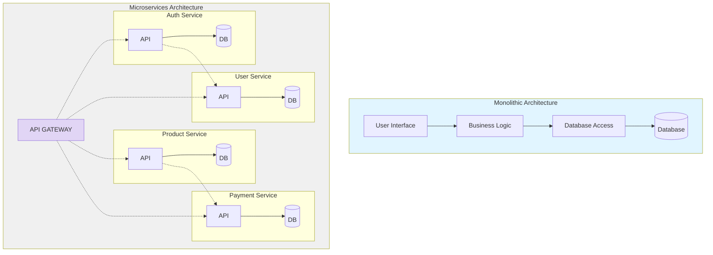
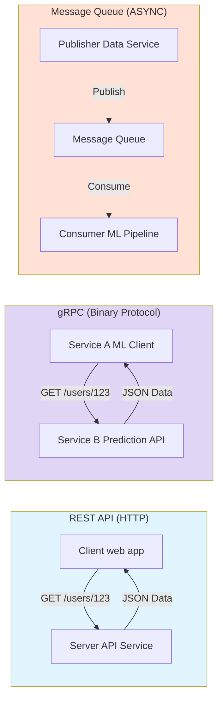
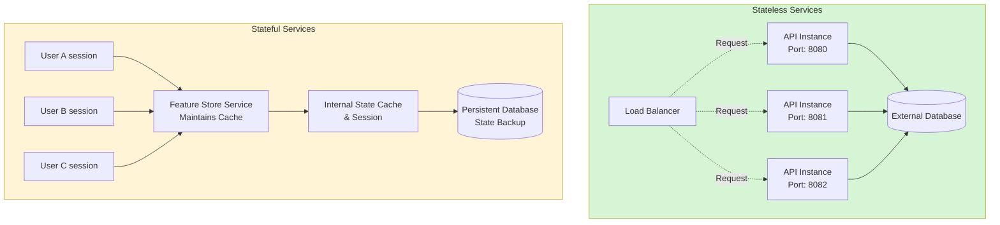
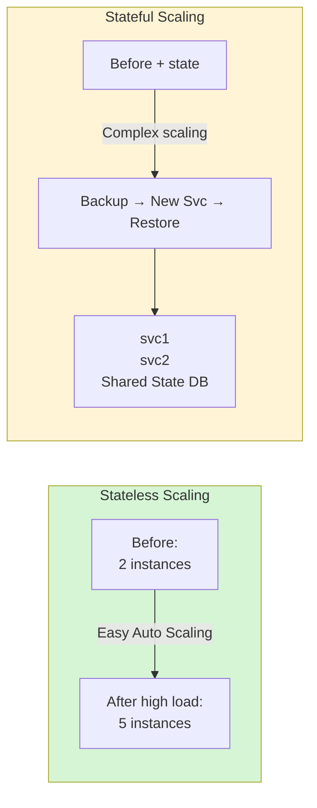
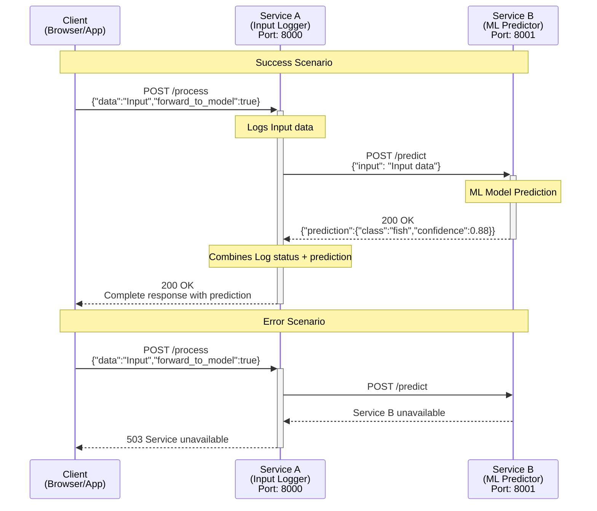

# Understanding Microservice Architecture for Machine Learning Applications

This guide explains how to use microservices architecture for machine learning (ML) applications. We start by looking at the basics of software design, comparing traditional monolithic systems with modern microservices. Next, we explore why microservices are a good fit for ML, highlight the key services that make up a solid ML setup, and look at how these services communicate with each other. Finally, we put everything into practice with a hands-on lab, where you'll build and test a simple microservices system made of two connected services that show the main ideas in action.

## What You Will Learn

You will:

- **Understand the fundamental differences between monolithic and microservices architectures**
- **Explore why microservices are particularly beneficial for machine learning applications**
- **Discover various communication patterns and protocols used between microservices**
- **Differentiate between stateless and stateful services and their implications**
- **Gain practical experience by building a simple two-service ML system**
- **See how Docker integrates with microservices architecture**

---

# Part 1 — Microservices Concepts (Complete Theory)

## 1) Monolithic vs Microservices Architecture

### Monolithic Architecture

Monolithic architecture represents the traditional approach to building applications where all components are tightly integrated into a single, unified codebase. This architecture is characterized by its simplicity in development, testing, and deployment processes in the early stages of an application's lifecycle.

In a monolithic architecture, all functional components—such as the user interface, business logic, and data access layers—are interconnected and interdependent. When developers need to make changes to any part of the application, they must update and redeploy the entire codebase, even if the change affects only a small portion of functionality.

While this architecture provides advantages in terms of initial development speed and simplicity in debugging (as everything runs in a single process), it presents significant challenges as applications grow in complexity. As the codebase expands, development teams may struggle with:

- **Codebase Complexity**: As more features are added, the codebase becomes increasingly difficult to understand, maintain, and extend.
- **Scaling Limitations**: When different components have varying resource requirements, the entire application must be scaled together, leading to inefficient resource utilization.
- **Technology Lock-in**: The entire application typically uses a single technology stack, making it difficult to adopt new technologies for specific components.
- **Deployment Risk**: Each deployment involves the entire application, increasing the risk of system-wide failures from localized issues.
- **Team Coordination Challenges**: Multiple teams working on different features must carefully coordinate their efforts to avoid conflicting changes.

For machine learning applications specifically, monolithic architectures can be particularly problematic due to the diverse nature of ML workflows—from data processing to model training to inference—each with unique resource requirements and technology preferences.

### Architecture Comparison



**Monolithic Architecture:**
- Tightly coupled components
- Single codebase
- Single deployment unit

**Microservices Architecture:**
- Loosely coupled services
- Independent codebases
- Separate deployment units
- Communication via APIs

### Monolithic Architecture - Pros and Cons

**Pros:**
- Simple at the beginning
- Easy local debugging
- Single deployment pipeline

**Cons (especially for ML systems):**
- Hard to scale specific parts (inference vs training)
- Technology lock-in (one stack for everything)
- Risky deployments (small change redeploys everything)
- Slower teams (coordination & merge conflicts)
- ML workflows are diverse (data ingestion, preprocessing, training, inference all need different resources)

### Microservices Architecture

Microservices architecture represents a paradigm shift in application design, decomposing what would traditionally be a monolithic application into a collection of smaller, independent services that work together. Each microservice is responsible for a specific business capability and operates as a separate entity with its own codebase, database (if needed), and deployment pipeline.

This architectural approach is built on several key principles:

- **Single Responsibility**: Each service focuses on doing one thing well, aligning with specific business domains or capabilities.
- **Autonomy**: Services can be developed, deployed, and scaled independently without affecting other parts of the system.
- **Resilience**: Failures in one service are contained and don't cascade throughout the entire system.
- **Technological Diversity**: Different services can use different programming languages, frameworks, and databases based on what best suits their specific requirements.
- **Decentralized Data Management**: Each service can manage its own data storage, using the most appropriate database technology for its needs.

The boundaries between microservices are defined by APIs that enable communication while maintaining loose coupling. This separation creates clear contracts between services and prevents unnecessary dependencies.

**Why microservices fit ML:**

For machine learning systems, microservices provide particular advantages:

- **Specialized Resources**: Different phases of ML pipelines (data processing, feature engineering, model training, inference) can receive exactly the resources they need.
- **Independent Scaling**: Inference services that handle user requests can scale based on traffic patterns, while training services can scale based on model complexity and data volume.
- **Technology Optimization**: Each service can use the optimal technology stack—TensorFlow for one model, PyTorch for another, specialized hardware for specific algorithms.
- **Continuous Deployment**: New features or models can be deployed without disrupting the entire system, enabling more rapid experimentation and improvement.
- **Observability**: Observability can be ML-aware (latency + drift + model performance)

---

## 2) Core Services in ML Microservices Architecture

A robust ML microservices platform consists of multiple specialized services, each handling a specific aspect of the machine learning lifecycle. Understanding these core services helps in designing scalable and maintainable ML systems.

### Data Ingestion Service

The data ingestion service serves as the entry point for all data flowing into the ML system. It must handle diverse data sources, formats, and volumes while ensuring data integrity and reliability. A robust implementation should process both batch and streaming data with appropriate error handling and retry mechanisms.

**Key responsibilities:**
- Connecting to external sources (databases, APIs, streams)
- Validating incoming data against schemas
- Publishing events to trigger downstream processing

### Preprocessing Service

Raw data rarely arrives in a form suitable for machine learning. The preprocessing service transforms this raw data into a clean, structured format ready for feature extraction and model training. It maintains versioned transformation pipelines to prevent training-serving skew.

**Key responsibilities:**
- Handling missing values and outliers
- Normalizing and standardizing data
- Applying domain-specific transformations

### Feature Store Service

The feature store has emerged as a critical component in modern ML architectures, serving as a centralized repository for features used across multiple models. By centralizing feature computation and storage, it eliminates redundant processing and ensures consistent definitions.

**Key responsibilities:**
- Storing computed features with metadata
- Ensuring consistency between training and serving
- Enabling feature sharing across teams and models

### Model Training Service

This service orchestrates the resource-intensive process of training ML models, from simple regression models to complex neural networks. It integrates with experiment tracking tools to maintain comprehensive records of training runs.

**Key responsibilities:**
- Executing training jobs on appropriate hardware
- Performing hyperparameter optimization
- Evaluating and registering trained models

### Model API Service (Inference / Model API)

The model API service exposes trained models through well-defined interfaces, handling the critical transition from development to production. As the public face of the ML system, it requires special attention to reliability, scalability, and security.

**Key responsibilities:**
- Implementing prediction endpoints with appropriate interfaces
- Validating inputs and transforming outputs
- Monitoring performance metrics like latency and throughput

### Monitoring Service

Continuous monitoring is essential to detect issues early and maintain performance over time. This service tracks both technical metrics and ML-specific concerns like data drift and concept drift.

**Key responsibilities:**
- Detecting data and concept drift
- Alerting on performance degradation
- Visualizing metrics through dashboards

### Additional Services

There are many other services that can enhance an ML microservices platform:

- **Metadata Service**: Manages metadata about datasets, models, and experiments
- **Experiment Tracking Service**: Logs and tracks ML experiments
- **Model Registry Service**: Versioned model artifacts + metadata + approvals
- **Data Versioning Service**: Tracks different versions of datasets
- **A/B Testing Service**: Enables experimentation with different model versions
- **Feature Engineering Service**: Automated feature creation and selection
- **Workflow Orchestration Service**: Workflow engines (Airflow, Argo Workflows, etc.)
- **Model Deployment Service**: Handles model deployment and rollback
- **Authentication & Authorization Service**: Security and access control
- **Configuration Management Service**: Centralized configuration
- **Data Lineage Service**: Tracks data flow and transformations
- **Model Governance Service**: Ensures compliance and model quality
- **Notification Service**: Alerts and notifications
- **Batch Processing Service**: Handles large-scale batch jobs
- **Continuous Integration/Continuous Deployment (CI/CD) Service**: Pipelines for code + model promotion

### This Lab's Focus

This lab focuses on a **minimal** slice to demonstrate core concepts:
- **Service A** = gateway/logging/orchestration (represents Data Ingestion + Gateway patterns)
- **Service B** = inference service (mock model) (represents Model API Service)

---

## 3) Communication Patterns Between Microservices

In a microservices architecture, the way services communicate is as important as the services themselves. Different communication patterns serve different needs, and selecting the appropriate approach impacts system performance, reliability, and maintainability.

### Limitations of REST

While REST is versatile, it's not optimal for all communication patterns:
- **Performance overhead** from HTTP headers and connection establishment
- **Limited support for bi-directional communication**
- **Can be verbose for complex data structures**
- **Not ideal for high-frequency, low-latency requirements**

### Communication Patterns Comparison



### REST (Representational State Transfer)

REST is a widely adopted architectural style for building web services, leveraging standard HTTP methods for communication between services. It is characterized by its stateless nature, where each request from client to server must contain all information needed to understand and process the request.

#### Implementation Details

REST communications typically use JSON or XML as data formats and rely on standard HTTP methods:

- **GET**: Retrieve resources without side effects
- **POST**: Create new resources
- **PUT**: Update existing resources
- **DELETE**: Remove resources

Services expose well-defined endpoints that represent resources or actions, following a consistent URL structure.

**Example REST API endpoint using FastAPI:**

```python
@app.post("/models/{model_id}/predictions")
async def create_prediction(model_id: str, data: PredictionRequest):
    # Retrieve model from registry
    model = model_registry.get_model(model_id)
    
    # Make prediction
    prediction = model.predict(data.features)
    
    # Return prediction result
    return PredictionResponse(
        prediction=prediction,
        model_id=model_id,
        model_version=model.version,
        timestamp=datetime.now()
    )
```

**REST API Key Features:**
- Synchronous request-response
- Standard HTTP methods
- Human-readable (JSON/XML)
- Stateless communication

#### When to Use REST

REST is particularly well-suited for:

- **Public-facing APIs** that need to be accessible to diverse clients
- **Simple request-response interactions** where the overhead of HTTP is acceptable
- **Services that benefit from HTTP features** like caching, content negotiation, and authentication
- **Scenarios where human readability and self-documentation are important**

REST's widespread adoption means excellent tooling support, including automatic API documentation (Swagger/OpenAPI), client generation, and testing frameworks.

**REST is Best For:**
- Public APIs and web services
- Simple CRUD operations
- Human-readable debugging
- Caching and standard HTTP features

#### Limitations

While REST is versatile, it's not optimal for all communication patterns:
- Performance overhead from HTTP headers and connection establishment
- Limited support for bi-directional communication
- Can be verbose for complex data structures
- Not ideal for high-frequency, low-latency requirements

**This lab uses REST** (simplest to learn and test).

---

### gRPC (Google Remote Procedure Call)

gRPC is a high-performance RPC framework designed for efficient service-to-service communication. It uses Protocol Buffers (protobuf) as its Interface Definition Language (IDL) and data serialization format, providing strongly typed contracts between services.

#### Implementation Details

gRPC services are defined using Protocol Buffer files that specify methods and message types:

```protobuf
// Model service definition
service ModelService {
  // Get prediction from model
  rpc Predict(PredictionRequest) returns (PredictionResponse) {}
  
  // Stream predictions for multiple inputs
  rpc PredictStream(stream PredictionRequest) returns (stream PredictionResponse) {}
}

// Request message
message PredictionRequest {
  string model_id = 1;
  repeated float features = 2;
}

// Response message
message PredictionResponse {
  float prediction = 1;
  float confidence = 2;
  string model_version = 3;
}
```

From these definitions, gRPC generates client and server code in various languages, handling serialization, deserialization, and network communication.

**gRPC Key Features:**
- High Performance Binary Protocol
- Bi-directional Streaming
- Strong typing (Protocol Buffers)
- Multi-language support

#### When to Use gRPC

gRPC excels in scenarios requiring:

- **High-performance, low-latency service-to-service communication**
- **Strong typing and contract enforcement** between services
- **Polyglot environments** with services in multiple programming languages
- **Support for streaming data** in either direction
- **Efficient binary serialization** for reduced network overhead

gRPC is particularly valuable for internal service communication in ML systems where performance is critical.

**gRPC is Best For:**
- High performance internal APIs
- Real-time Streaming data
- Microservices Communication
- Low-Latency requirements

#### Advanced Features

gRPC offers several advanced capabilities beyond basic RPC:

- **Bi-directional streaming** for real-time communication
- **Built-in load balancing** and service discovery integration
- **Deadline propagation** for timeout management
- **Interceptors** for cross-cutting concerns like logging and authentication
- **Backward compatibility mechanisms** for evolving APIs

---

### Message Queues (Kafka, RabbitMQ, Pulsar)

Message-based communication uses intermediate brokers to decouple services, enabling asynchronous interactions where senders and receivers operate independently.

#### Implementation Details

In a message-based architecture:

- **Publishers** send messages to topics or queues without knowledge of consumers
- **The message broker** reliably stores messages and handles delivery
- **Consumers** process messages at their own pace, with no direct connection to publishers

**Kafka producer example - publishing a data ingestion event:**

```python
def publish_data_arrival_event(dataset_id, records_count, timestamp):
    event = {
        "event_type": "data_ingestion_completed",
        "dataset_id": dataset_id,
        "records_count": records_count,
        "timestamp": timestamp.isoformat(),
        "source_system": "web_analytics"
    }
    
    # Serialize and publish the event
    producer.send(
        topic="data-events",
        key=dataset_id,
        value=json.dumps(event).encode('utf-8')
    )
    producer.flush()
```

**Kafka consumer example - preprocessing service:**

```python
for message in consumer:
    event = json.loads(message.value.decode('utf-8'))
    
    if event["event_type"] == "data_ingestion_completed":
        # Trigger preprocessing pipeline
        preprocessing_pipeline.process_dataset(
            dataset_id=event["dataset_id"],
            source=event["source_system"]
        )
```

**Message Queue Key Features:**
- Asynchronous messaging
- Reliable message delivery
- Decoupled services
- Load Balancing and buffering

#### When to Use Message Queues

Message-based communication is ideal for:

- **Decoupling services** to enhance resilience and independent scaling
- **Handling workload spikes** through buffering
- **Implementing event-driven architectures** where actions are triggered by system events
- **Ensuring reliable delivery** of messages even when downstream services are temporarily unavailable
- **Broadcasting events** to multiple consumers simultaneously

In ML systems, message queues often facilitate the flow of data through processing pipelines, with each stage publishing events that trigger subsequent processing.

**Message Queues are Best For:**
- Event-driven architecture
- Background job processing
- Handling traffic spikes
- Loose coupling services

#### Types of Message Patterns

Different messaging systems support various communication patterns:

- **Publish-Subscribe**: Messages are broadcast to all subscribed consumers (e.g., Kafka topics)
- **Point-to-Point**: Messages are delivered to exactly one consumer from a pool (e.g., RabbitMQ queues)
- **Request-Reply**: Asynchronous request-response interactions through temporary reply queues
- **Dead Letter Queues**: Special queues for messages that cannot be processed, enabling retry strategies

Each pattern serves different use cases within a microservices architecture.

---

## 4) Stateless vs Stateful Services

The distinction between stateless and stateful services is fundamental to microservices architecture, affecting how services are designed, deployed, and scaled.

### Stateless Services

Stateless services do not store client state between requests. Each request contains all the information needed to process it, without relying on server-side session data.

#### Characteristics of Stateless Services

**Independence from Previous Interactions:** Each request is processed without knowledge of previous requests. This means that any service instance can handle any request, enabling simple horizontal scaling.

**Simplified Recovery:** If a stateless service instance fails, requests can be immediately redirected to another instance without data loss or inconsistency.

**Deployment Flexibility:** New versions can be deployed using strategies like blue-green deployment or rolling updates without complex state migration.

**Resource Efficiency:** Instances can be added or removed based on demand without concerns about state transfer.

### Architecture Comparison



**Stateless Benefits:**
- Easy horizontal scaling - add/remove instances anytime
- No data loss on failure - any instance can handle any request
- Simple deployment - rolling updates without state migration

**Stateful Challenges:**
- Complex scaling - state must be migrated or replicated
- Recovery complexity - state must be restored after failures
- Consistency challenges - multiple instances need synchronized state

### Scaling Comparison



### Examples in ML Systems

**Stateless Services:**
- **Model Inference Services**: Services that load a model and make predictions based solely on input data
- **Data Transformation Services**: Services that apply defined transformations to incoming data
- **Validation Services**: Services that check data against schemas or rules
- REST APIs
- ML inference
- Image processing
- Authentication

#### Implementation Considerations

To maintain statelessness while still providing personalized experiences, stateless services often:

- Store state externally in databases or caches
- Pass state information in request parameters or headers
- Use token-based authentication instead of session cookies
- Employ idempotent operations that can be safely retried

**Stateless model inference service example:**

```python
@app.post("/predict")
async def predict(request: PredictionRequest):
    # Load model based on request parameter
    model = model_registry.get_model(
        model_id=request.model_id,
        version=request.model_version
    )
    
    # Process request using only the provided data
    prediction = model.predict(request.features)
    
    # Return response without storing any client state
    return {
        "prediction": prediction,
        "model_id": request.model_id,
        "request_id": generate_uuid(),
        "timestamp": datetime.now().isoformat()
    }
```

### Stateful Services

Stateful services maintain client state between requests, remembering information from previous interactions or maintaining internal state critical to their operation.

#### Characteristics of Stateful Services

**Persistent State:** These services maintain data that persists beyond individual requests, either in memory or persistent storage directly tied to the service.

**Complex Scaling:** Adding or removing instances requires careful state management, often involving data replication, sharding, or migration.

**State Consistency Challenges:** When multiple instances exist, ensuring all instances have a consistent view of the state becomes critical.

**Recovery Complexity:** After failures, the service must recover its state before resuming normal operation.

### Examples in ML Systems

**Stateful Services:**
- **Feature Stores**: Maintain feature values and metadata across requests
- **Model Registry Services**: Track model versions, artifacts, and deployment status
- **Session-Based Recommendation Services**: Maintain user session context to provide contextual recommendations
- **Online Learning Services**: Update model parameters based on streaming data
- Databases
- Session storage
- Shopping Carts
- Real-time Gaming

#### Implementation Considerations

Stateful services require special attention to:

- State persistence and durability
- Replication strategies for high availability
- Consistency models and potential trade-offs
- Backup and recovery procedures
- State migration during upgrades

**Stateful feature store service example:**

```python
class FeatureStoreService:
    def __init__(self, storage_engine):
        self.storage = storage_engine
        self.cache = LRUCache(max_size=10000)
    
    def get_feature_vector(self, entity_id, feature_names, timestamp=None):
        # Check cache first
        cache_key = f"{entity_id}:{','.join(feature_names)}:{timestamp}"
        if cache_key in self.cache:
            return self.cache[cache_key]
        
        # Retrieve from persistent storage
        features = self.storage.get_features(
            entity_id=entity_id,
            feature_names=feature_names,
            timestamp=timestamp
        )
        
        # Update cache for future requests
        self.cache[cache_key] = features
        
        return features
    
    def update_feature(self, entity_id, feature_name, value, timestamp):
        # Update persistent storage
        self.storage.store_feature(
            entity_id=entity_id,
            feature_name=feature_name,
            value=value,
            timestamp=timestamp
        )
        
        # Invalidate relevant cache entries
        self.cache.invalidate_pattern(f"{entity_id}:*")
```

### Hybrid Approaches

Many modern ML systems adopt hybrid approaches:

- **Core business logic** in stateless services for scalability
- **State externalized** to specialized stateful services
- **Caching layers** to improve performance while maintaining scalability
- **Event sourcing patterns** to reconstruct state when needed

**This lab's services are stateless** (aside from logs / in-memory model object).

---

## 5) Docker and Microservices

Docker containers provide an ideal deployment mechanism for microservices, encapsulating each service with its dependencies in a lightweight, portable format. This containerization approach offers numerous benefits for ML microservices specifically:

- **Consistent Environments**: Eliminates "it works on my machine" problems by packaging all dependencies
- **Resource Isolation**: Prevents conflicts between services with different dependency requirements
- **Efficient Resource Usage**: Allows multiple containers to share the same host OS kernel
- **Rapid Deployment**: Enables quick startup and shutdown of services
- **Portability**: Runs consistently across development, testing, and production environments

In production, microservices are commonly shipped as containers:
- each service → its own image
- dependencies isolated
- portable across dev/stage/prod
- health checks + resource limits

### Dockerfile Example

A typical Dockerfile for an ML microservice might include:

- Base image with appropriate ML frameworks
- System dependencies for numerical processing
- Python packages for the specific service
- Service code and configuration
- Health check endpoints
- Environment-specific settings via environment variables

**Example Dockerfile for an ML inference service:**

```dockerfile
FROM python:3.9-slim

# Install system dependencies
RUN apt-get update && apt-get install -y \
    libgomp1 \
    && rm -rf /var/lib/apt/lists/*

# Set working directory
WORKDIR /app

# Copy requirements and install dependencies
COPY requirements.txt .
RUN pip install --no-cache-dir -r requirements.txt

# Copy model and service code
COPY models/ ./models/
COPY service/ ./service/

# Set environment variables
ENV MODEL_PATH=/app/models/xgboost_v3.pkl
ENV LOG_LEVEL=INFO
ENV MAX_WORKERS=4

# Expose the service port
EXPOSE 8080

# Health check
HEALTHCHECK --interval=30s --timeout=3s \
  CMD curl -f http://localhost:8080/health || exit 1

# Run the service
CMD ["python", "service/main.py"]
```

**This lab supports both approaches:**
- **Docker** (recommended): Full containerization with docker-compose
- **venv** (local dev): Virtual environments for local development

---

# Part 2 — The Actual Lab Implementation (2 Services)

This repository contains a complete, runnable **two-microservice** lab for a simple machine-learning-style system:

- **Service A (Input Logger / Gateway)**: Receives client requests, logs inputs, and optionally forwards the request to the ML service.
- **Service B (ML Predictor)**: A dedicated service that returns a mock "prediction" (random class + confidence) for demo purposes.

The project is designed to teach both:
1) **Microservices theory (why/how)**, and  
2) The **practical workflow** of running two independent services that communicate over HTTP.

## Repo structure

```text
ml_microservices_lab/
├── service_a/
│   ├── main.py
│   ├── requirements.txt
│   └── Dockerfile
├── service_b/
│   ├── main.py
│   ├── requirements.txt
│   └── Dockerfile
├── docker-compose.yml
├── .dockerignore
├── .gitignore
└── README.md
```

> **Recommended local practice:** create a **separate Python virtual environment (venv) per service**.
That mirrors real microservices deployments (one container/image per service).

## High-level flow

1. Client sends request to **Service A**:
   - `POST http://localhost:8000/process`
   - body: `{ "data": "...", "forward_to_model": true/false }`

2. Service A logs the input and:
   - If `forward_to_model=false`: returns logging status only
   - If `forward_to_model=true`: calls Service B `POST http://localhost:8001/predict`

3. Service B returns a mock prediction (random class + confidence)

4. Service A returns a combined response.

## Communication Flow Diagram



**Legend:**
- **Request**: Solid arrow (→)
- **Response**: Dashed arrow (-->>)
- **Error**: Red dashed arrow
- **Internal Action**: Note boxes

---

# Part 3 — Setup & Run

## Option A: Docker Setup (Recommended)

Docker provides containerized, isolated environments for both services. This is the recommended approach for consistency across different operating systems.

### Prerequisites

- [Docker](https://docs.docker.com/get-docker/) installed
- [Docker Compose](https://docs.docker.com/compose/install/) installed

### Quick Start with Docker

1. **Build and start both services:**
   ```bash
   docker-compose up --build
   ```

   This will:
   - Build Docker images for both services
   - Start Service B on port 8001
   - Start Service A on port 8000 (after Service B is healthy)
   - Create a Docker network for service communication

2. **Run in detached mode (background):**
   ```bash
   docker-compose up -d --build
   ```

3. **View logs:**
   ```bash
   # All services
   docker-compose logs -f
   
   # Specific service
   docker-compose logs -f service_a
   docker-compose logs -f service_b
   ```

4. **Stop services:**
   ```bash
   docker-compose down
   ```

5. **Rebuild after code changes:**
   ```bash
   docker-compose up --build
   ```

### Docker Health Checks

Both services include health checks. Service A waits for Service B to be healthy before starting.

Check service status:
```bash
docker-compose ps
```

### Docker Networking

Services communicate via Docker's internal network:
- Service A connects to Service B using: `http://service_b:8001/predict`
- From your host machine, use: `http://localhost:8000` and `http://localhost:8001`

### Docker Troubleshooting

**View container logs:**
```bash
docker-compose logs service_a
docker-compose logs service_b
```

**Restart a specific service:**
```bash
docker-compose restart service_a
docker-compose restart service_b
```

**Remove containers and rebuild:**
```bash
docker-compose down
docker-compose up --build
```

**Check if ports are available:**
```bash
# Windows PowerShell
netstat -ano | findstr :8000
netstat -ano | findstr :8001

# Linux/Mac
lsof -i :8000
lsof -i :8001
```

---

## Option B: Local Setup (Ubuntu/Debian safe way)

> If you are on Ubuntu/Debian with Python 3.12+, you may see:
> `error: externally-managed-environment` (PEP 668).
> The fix is to use a **virtual environment** (venv). Do **not** install packages system-wide.

### 0) Prerequisites

```bash
sudo apt update
sudo apt install -y python3-full python3-venv
```

---

### 1) Run Service B (Terminal 1)

```bash
cd service_b

python3 -m venv venv
source venv/bin/activate

pip install -r requirements.txt
python main.py
```

Service B will run on: `http://localhost:8001`

Health check:
```bash
curl http://localhost:8001/health
```

---

### 2) Run Service A (Terminal 2)

```bash
cd service_a

python3 -m venv venv
source venv/bin/activate

pip install -r requirements.txt
python main.py
```

Service A will run on: `http://localhost:8000`

Health check:
```bash
curl http://localhost:8000/health
```

---

# Part 4 — Testing the Services

This section covers multiple ways to test the microservices: curl, Postman, and Swagger UI.

## Method 1: Using curl (Command Line)

### 1) Service A without forwarding (only logging)

```bash
curl -X POST -H "Content-Type: application/json" \
  -d '{"data":"sample input","forward_to_model":false}' \
  http://localhost:8000/process
```

**Expected response:**
```json
{"status":"Input logged successfully"}
```

### 2) Service A with forwarding (A → B)

```bash
curl -X POST -H "Content-Type: application/json" \
  -d '{"data":"cat image data","forward_to_model":true}' \
  http://localhost:8000/process
```

**Expected response:**
```json
{
  "status": "Input logged successfully",
  "model_prediction": {
    "prediction": {
      "class": "dog",
      "confidence": 0.92,
      "input_length": 13
    },
    "message": "Predicted class: dog with 92.0% confidence"
  }
}
```

### 3) Call Service B directly

```bash
curl -X POST -H "Content-Type: application/json" \
  -d '{"input":"test input"}' \
  http://localhost:8001/predict
```

**Expected response:**
```json
{
  "prediction": {
    "class": "bird",
    "confidence": 0.87,
    "input_length": 10
  },
  "message": "Predicted class: bird with 87.0% confidence"
}
```

### 4) Health check endpoints

```bash
# Service A health check
curl http://localhost:8000/health

# Service B health check
curl http://localhost:8001/health

# Service A root endpoint
curl http://localhost:8000/

# Service B root endpoint
curl http://localhost:8001/
```

---

## Method 2: Using Postman

### Setup

1. **Install Postman** from [postman.com](https://www.postman.com/downloads/)

2. **Create a new Collection** named "ML Microservices Lab"

### Test Cases

#### Test 1: Service A - Process without forwarding

- **Method:** `POST`
- **URL:** `http://localhost:8000/process`
- **Headers:**
  - `Content-Type: application/json`
- **Body (raw JSON):**
  ```json
  {
    "data": "sample input",
    "forward_to_model": false
  }
  ```
- **Expected Status:** `200 OK`
- **Expected Response:**
  ```json
  {
    "status": "Input logged successfully"
  }
  ```

#### Test 2: Service A - Process with forwarding

- **Method:** `POST`
- **URL:** `http://localhost:8000/process`
- **Headers:**
  - `Content-Type: application/json`
- **Body (raw JSON):**
  ```json
  {
    "data": "cat image data",
    "forward_to_model": true
  }
  ```
- **Expected Status:** `200 OK`
- **Expected Response:** Contains `status` and `model_prediction` fields

#### Test 3: Service B - Direct prediction

- **Method:** `POST`
- **URL:** `http://localhost:8001/predict`
- **Headers:**
  - `Content-Type: application/json`
- **Body (raw JSON):**
  ```json
  {
    "input": "test input"
  }
  ```
- **Expected Status:** `200 OK`
- **Expected Response:** Contains `prediction` and `message` fields

#### Test 4: Health Checks

- **Service A Health:**
  - Method: `GET`
  - URL: `http://localhost:8000/health`
  
- **Service B Health:**
  - Method: `GET`
  - URL: `http://localhost:8001/health`

### Postman Tips

- **Save requests** in your collection for easy reuse
- **Use environment variables** for base URLs (e.g., `{{base_url}}/process`)
- **Create test scripts** to validate response structure
- **Export collection** to share with your team

---

## Method 3: Using Swagger UI (Interactive API Documentation)

FastAPI automatically generates interactive API documentation using Swagger UI.

### Access Swagger UI

1. **Service A Swagger UI:**
   - Open browser: `http://localhost:8000/docs`
   - This shows all endpoints for Service A

2. **Service B Swagger UI:**
   - Open browser: `http://localhost:8001/docs`
   - This shows all endpoints for Service B

### Using Swagger UI

#### Test Service A `/process` endpoint:

1. Navigate to `http://localhost:8000/docs`
2. Find the `POST /process` endpoint
3. Click "Try it out"
4. Enter request body:
   ```json
   {
     "data": "cat image data",
     "forward_to_model": true
   }
   ```
5. Click "Execute"
6. View the response in the "Responses" section

#### Test Service B `/predict` endpoint:

1. Navigate to `http://localhost:8001/docs`
2. Find the `POST /predict` endpoint
3. Click "Try it out"
4. Enter request body:
   ```json
   {
     "input": "test input"
   }
   ```
5. Click "Execute"
6. View the response

### Alternative: ReDoc Documentation

FastAPI also provides ReDoc documentation:

- **Service A ReDoc:** `http://localhost:8000/redoc`
- **Service B ReDoc:** `http://localhost:8001/redoc`

ReDoc provides a cleaner, more readable documentation format.

---

## Testing Scenarios

### Scenario 1: Service B unavailable

1. Stop Service B (or don't start it)
2. Send request to Service A with `forward_to_model: true`
3. **Expected:** Service A returns `503 Service Unavailable` error

### Scenario 2: Invalid request format

1. Send request to Service A with missing `data` field:
   ```json
   {
     "forward_to_model": true
   }
   ```
2. **Expected:** `422 Unprocessable Entity` validation error

### Scenario 3: Different input lengths

Test with various input lengths to see `input_length` in responses:
- Short: `"hi"`
- Medium: `"this is a medium length input"`
- Long: `"this is a very long input string with many characters"`

---

## Quick Test Script

Save this as `test_services.sh` (Linux/Mac) or `test_services.ps1` (Windows):

**Linux/Mac (`test_services.sh`):**
```bash
#!/bin/bash

echo "Testing Service A Health..."
curl http://localhost:8000/health
echo -e "\n\n"

echo "Testing Service B Health..."
curl http://localhost:8001/health
echo -e "\n\n"

echo "Testing Service A without forwarding..."
curl -X POST -H "Content-Type: application/json" \
  -d '{"data":"test","forward_to_model":false}' \
  http://localhost:8000/process
echo -e "\n\n"

echo "Testing Service A with forwarding..."
curl -X POST -H "Content-Type: application/json" \
  -d '{"data":"test input","forward_to_model":true}' \
  http://localhost:8000/process
echo -e "\n\n"

echo "Testing Service B directly..."
curl -X POST -H "Content-Type: application/json" \
  -d '{"input":"test"}' \
  http://localhost:8001/predict
```

**Windows PowerShell (`test_services.ps1`):**
```powershell
Write-Host "Testing Service A Health..."
Invoke-RestMethod -Uri http://localhost:8000/health
Write-Host "`n"

Write-Host "Testing Service B Health..."
Invoke-RestMethod -Uri http://localhost:8001/health
Write-Host "`n"

Write-Host "Testing Service A without forwarding..."
$body = @{
    data = "test"
    forward_to_model = $false
} | ConvertTo-Json
Invoke-RestMethod -Uri http://localhost:8000/process -Method Post -Body $body -ContentType "application/json"
Write-Host "`n"

Write-Host "Testing Service A with forwarding..."
$body = @{
    data = "test input"
    forward_to_model = $true
} | ConvertTo-Json
Invoke-RestMethod -Uri http://localhost:8000/process -Method Post -Body $body -ContentType "application/json"
Write-Host "`n"

Write-Host "Testing Service B directly..."
$body = @{
    input = "test"
} | ConvertTo-Json
Invoke-RestMethod -Uri http://localhost:8001/predict -Method Post -Body $body -ContentType "application/json"
```

---

# Part 5 — Troubleshooting (Do not skip)

## A) `error: externally-managed-environment` (PEP 668)

**Cause:** OS-managed Python blocks system-wide pip installs.  
**Fix (recommended):** Use venv:

```bash
python3 -m venv venv
source venv/bin/activate
pip install -r requirements.txt
```

**Avoid:** `pip install --break-system-packages` (risk of breaking your OS Python).

---

## B) Port already in use (8000 or 8001)

Symptoms:
- `Address already in use`
- Service won't start

Find the process:
```bash
sudo lsof -i :8000
sudo lsof -i :8001
```

Kill it (example PID):
```bash
sudo kill -9 <PID>
```

---

## C) Service A returns 503 "Service B is unavailable"

Cause:
- Service B isn't running
- Wrong port
- Network restriction

Fix checklist:
1. Start Service B first
2. Verify:
   ```bash
   curl http://localhost:8001/health
   ```
3. Confirm Service A has:
   - `SERVICE_B_URL = "http://localhost:8001/predict"`

---

## D) Wrong python/pip being used

If you suspect you're not inside venv:
```bash
which python
which pip
python --version
```

Inside venv, `which python` should point to:
`.../service_x/venv/bin/python`

---

## E) `ModuleNotFoundError` for installed packages

Usually means:
- venv not activated
- installed packages into another environment

Fix:
```bash
source venv/bin/activate
pip install -r requirements.txt
```

---

## F) Uvicorn reload issues (inside some containers/VM setups)

`reload=True` is great for local dev, but can be noisy in certain environments.

You can disable reload by editing main.py:
- Service A: `reload=False`
- Service B: `reload=False`

Or run directly with uvicorn:
```bash
uvicorn main:app --host 0.0.0.0 --port 8000
uvicorn main:app --host 0.0.0.0 --port 8001
```

---

# Part 6 — What to improve next (real production direction)

This lab intentionally uses simple choices. In real systems, you'd typically add:

- **Service discovery**: DNS/Consul/etcd instead of hard-coded URLs
- **Resilience patterns**: retries, timeouts, circuit breakers, fallbacks
- **Async messaging**: Kafka/RabbitMQ/Pulsar to decouple pipelines
- **Observability**: OpenTelemetry traces, metrics, structured logs
- **Containerization**: ✅ Already implemented! (Dockerfile + docker-compose.yml)
- **Security**: authn/authz, mTLS, rate limiting

---

# Conclusion

In this lab, we've examined the key differences between traditional monolithic architectures and modern microservices approaches, understanding how the latter provides benefits like independent scaling, technology flexibility, fault isolation, and team specialization. We've learned about the core services that comprise a robust ML system, including data ingestion, preprocessing, feature store, model training, model API, and monitoring services, along with many other specialized services that can enhance an ML pipeline. We've also investigated various communication patterns between microservices, including REST APIs, gRPC, and message queues, and understood the critical distinction between stateless and stateful services. Additionally, we've seen how Docker containers provide an ideal deployment mechanism for microservices by encapsulating each service with its dependencies in a lightweight, portable format. This foundation of knowledge prepares us to implement a practical microservices system that demonstrates these principles in action.

---

## License
MIT (use freely for learning and demos)

